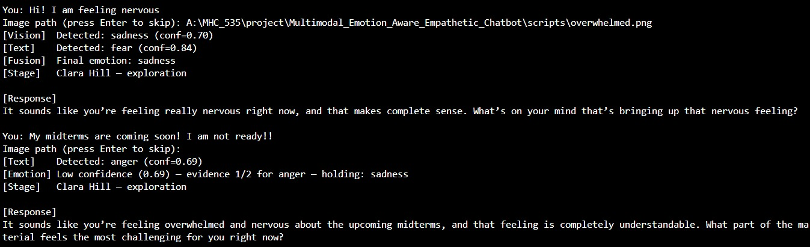
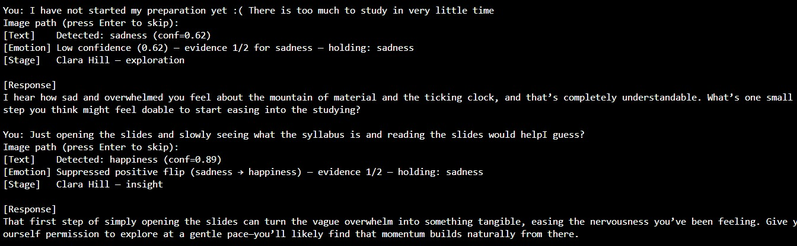
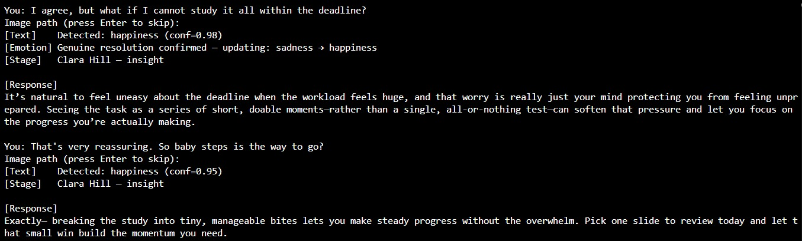
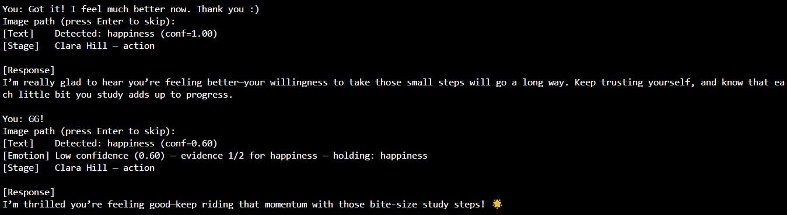

# Emotion Aware Empathetic Chatbot

<p align="center">
  
</p>

<h3 align="center">A multimodal conversational AI that reads your face, understands your words, and responds the way a good listener would.</h3>

<p align="center">
  
  
  
  
  
  
</p>

---

## About

Modern conversational AI is emotionally blind. It reads words but misses the face. It responds to what you type, not how you actually feel. When someone is in distress, they often describe their situation in composed, neutral language — unable or unwilling to articulate what their expression makes unmistakably clear. A text-only system has no way of knowing the difference.

**Emotion Aware Empathetic Chatbot** closes that gap. The system combines facial affective computing with large language model-driven dialogue generation through a two-stage pipeline: a visual emotion recognition module whose predictions are fused with text-based emotion signals via weighted calibration, followed by emotion-conditioned response generation. Every response is shaped not just by what you say, but by what your face and words together reveal about how you feel.

Response generation is structured by **Clara Hill's three-stage empathy framework**, automatically moving the conversation from emotional exploration through insight and toward gentle, forward-looking encouragement — as the dialogue naturally deepens.

---

## How It Works

The pipeline connects three independently designed modules into a single, stateful inference flow.

### 1. Dual-Modality Emotion Detection

When a user sends a message, two parallel processes run simultaneously.

The **visual module** processes a face image through ConvNeXt-Base, a hierarchical convolutional network that draws from Vision Transformer design principles, using depthwise convolutions with large kernels, LayerNorm, and an inverted bottleneck structure. The model classifies facial expressions into four emotionally grounded categories — happiness, sadness, fear, and anger — and outputs a softmax probability distribution. It was fine-tuned on a combined dataset of FER-2013, RAF-DB, and AffectNet, achieving 0.83 accuracy and 0.79 Macro F1.

The **text module** processes the input utterance through EmoRoBERTa, a RoBERTa-based model fine-tuned on GoEmotions. Its 28-class output is mapped and renormalized to the same four-class schema, preserving emotional continuity across modalities.

Both modules are entirely independent and operate in parallel, each producing a probability distribution over the shared emotion space.

### 2. Weighted Multimodal Fusion

The two probability distributions are combined using an empirically calibrated late fusion strategy:

```
P_final(e) = 0.6 · P_image(e) + 0.4 · P_text(e)
```

The 0.6 / 0.4 weighting was determined by grid search over a held-out validation set. Visual input carries slightly more weight because facial expression provides a more direct affective signal than surface-level text, particularly when users understate or mask their emotional state in language. The fused distribution determines the final emotion label via argmax, which is then passed downstream to condition response generation.

### 3. Session Emotion Management

A single emotion prediction over one utterance is not a reliable signal. Short messages, sarcastic phrasing, and momentary optimism can all produce detections that do not reflect the user's actual state. The pipeline addresses this by maintaining a **session emotion** that persists across turns and updates with deliberate caution.

On the first turn, the detected emotion is established as the session state. On subsequent text-only turns, the session emotion updates only when the new detection is both high-confidence and consistent with the emotional trajectory. Critically, a positive emotional shift from a negative session state — detecting happiness while the user has been expressing sadness — is suppressed unless the same high-confidence positive detection appears on two consecutive turns. This prevents enthusiastic one-liners from being misread as genuine emotional recovery.

When a face image is provided on any turn, emotion is always re-evaluated fresh, since visual input is a direct signal that takes priority over session history.

### 4. Clara Hill Stage Conditioning

Response generation is structured by Clara Hill's three-stage empathy framework, which controls the system's conversational behavior as the dialogue progresses. The stage advances automatically by turn count and governs which system prompt is sent to the dialogue model on each call.

| Stage | Turns | System Behavior |
|---|---|---|
| **Exploration** | 1 – 3 | Reflects the user's emotion, validates their experience, asks one open-ended question to understand more |
| **Insight** | 4 – 6 | Connects themes across the conversation, offers gentle observations, helps the user see their situation more clearly |
| **Action** | 7 + | Shifts toward encouragement and forward-looking support without offering direct or unsolicited advice |

The behavioral shift happens automatically as the conversation deepens. No explicit user signal or model fine-tuning for stage transitions is required.

### 5. Retrieval-Augmented Generation

At inference, the dialogue model receives the detected emotion label, the user's message, and — on the first turn only — three in-context examples retrieved from the EmpatheticDialogues training set. A per-emotion FAISS index is built over sentence embeddings, and the top-retrieved examples serve as emotion-aligned style demonstrations, helping the model calibrate tone and follow-up question quality to the user's specific affective state. RAG is applied only on the first turn to avoid disrupting the conversational context the model builds across subsequent turns. Full conversation history is passed on every turn thereafter.

---

## Demo

The following screenshots show a complete eight-turn conversation with the inference pipeline. The user provides a face image on the first turn. ConvNeXt-Base detects sadness with confidence 0.70, which after fusion with the text emotion establishes the opening session state. The system progresses through all three Clara Hill stages as the conversation unfolds.

<p align="center">
  
  <br><br>
  <em>Turns 1–2 · Exploration — Image and text fusion establishes sadness as the session emotion. Low-confidence anger detection on turn 2 is held pending further evidence.</em>
</p>

<br>

<p align="center">
  
  <br><br>
  <em>Turns 3–4 · Exploration → Insight — A high-confidence happiness detection is suppressed as a premature positive flip. Session remains at sadness.</em>
</p>

<br>

<p align="center">
  
  <br><br>
  <em>Turns 5–6 · Insight — Two consecutive high-confidence happiness detections confirm genuine emotional resolution. Session emotion updates from sadness to happiness.</em>
</p>

<br>

<p align="center">
  
  <br><br>
  <em>Turns 7–8 · Action — System shifts to forward-looking encouragement as the user reaches emotional resolution.</em>
</p>

---

## Results

### Vision Model

Nine architectures were evaluated on the combined image test set. ConvNeXt-Base was selected as the primary vision model based on its Macro F1 performance and, specifically, its stronger recall on anger and fear — the emotionally critical classes in an empathy context where missing a negative state carries a higher conversational cost than a false positive.

| Model | Accuracy | Macro F1 |
|---|---|---|
| ResNet (baseline) | 0.73 | 0.73 |
| Landmark Fusion | 0.73 | 0.73 |
| Landmark Attention | 0.74 | 0.74 |
| Image→Emotion (CBAM, RN18) | 0.69 | 0.68 |
| Image→Emotion (CBAM, RN50) | 0.74 | 0.74 |
| ResNet50 + Cross Attention | 0.69 | 0.68 |
| ViT + Landmark Fusion | 0.71 | 0.71 |
| EfficientNetV2-M | 0.83 | 0.78 |
| **ConvNeXt-Base** | **0.83** | **0.79** |

### Dialogue Generation

Six dialogue configurations were evaluated on the EmpatheticDialogues test set (5,259 samples) across BLEU, BERTScore F1, Distinct-1/2 lexical diversity, and Self-BLEU repetitiveness. GPT-OSS with retrieved in-context examples was selected as the final dialogue backend, combining the highest semantic alignment with the strongest diversity profile across all configurations.

| Metric | DG | DG Chatbot | DG Finetuned | Mistral Finetuned | GPT-OSS | **GPT-OSS + Examples** |
|---|:---:|:---:|:---:|:---:|:---:|:---:|
| BLEU ↑ | 1.08 | 0.62 | 0.86 | **2.18** | 0.53 | 0.69 |
| BERTScore F1 ↑ | 0.84 | 0.82 | 0.82 | **0.86** | 0.84 | **0.86** |
| Distinct-1 ↑ | 0.05 | 0.02 | 0.02 | 0.03 | 0.07 | **0.08** |
| Distinct-2 ↑ | 0.16 | 0.06 | 0.17 | 0.16 | 0.32 | **0.34** |
| Self-BLEU ↓ | 0.81 | 0.83 | 0.77 | 0.82 | 0.60 | **0.57** |

> DG = DialoGPT-medium. Self-BLEU measures response repetitiveness — lower is better. Standard lexical metrics such as BLEU are poorly suited to open-domain empathetic dialogue; BERTScore F1, Distinct-1/2, and Self-BLEU are the more informative signals here.

---

## Models and Datasets

### Models

| Component | Model |
|---|---|
| Facial Emotion Recognition | ConvNeXt-Base (ImageNet-22k pretrained, fine-tuned on FER-2013 + RAF-DB + AffectNet) |
| Text Emotion Recognition | EmoRoBERTa (RoBERTa fine-tuned on GoEmotions) |
| Dialogue Generation | GPT-OSS 120B with RAG-retrieved in-context examples |
| Dialogue Backbone (fine-tuned) | Mistral-7B-Instruct-v0.2 via QLoRA (r=32, 0.375% trainable parameters) |
| Sentence Embeddings for RAG | sentence-transformers |

### Datasets

The vision models are trained on a combination of **FER-2013**, **RAF-DB**, and **AffectNet**. The dialogue model is fine-tuned on **EmpatheticDialogues**, which also serves as the source for the RAG index.

All datasets are mapped to a unified four-class label schema — **happy, sad, fear, anger** — with class balancing applied during training to account for label distribution skew across sources.

---

## Getting Started

### Prerequisites

- Python 3.10+
- CUDA-capable GPU strongly recommended (inference is runnable on CPU but significantly slower)
- A [HuggingFace](https://huggingface.co) account and token for model loading
- A [Groq](https://console.groq.com) API key for GPT-OSS dialogue generation

### Installation

```bash
git clone https://github.com/your-username/emotion-aware-empathetic-chatbot.git
cd emotion-aware-empathetic-chatbot
pip install -r requirements.txt
```

> If you have a CUDA GPU, replace `faiss-cpu` with `faiss-gpu` in `requirements.txt` before installing.

### Configuration

```bash
cp .env.example .env
```

Open `.env` and provide values for:
- `HF_TOKEN` — your HuggingFace token, required to load ConvNeXt-Base and EmoRoBERTa
- `GROQ_API_KEY` — your Groq API key for GPT-OSS dialogue generation

### Model Checkpoints

Place your trained ConvNeXt-Base checkpoint under `checkpoints/`:

```bash
mkdir checkpoints
# Place your trained ConvNeXt-Base .pth file here
```

The `vector_store/` directory is included via Git LFS and is ready to use without any rebuild step.

### Running Inference

```bash
python inference.py --interactive
```

This launches the pipeline in interactive mode — the terminal prompts for a text message and optionally a face image path on each turn. Press Enter to skip the image on any turn and run in text-only mode.

### Training the Vision Model

Preprocess the datasets first, then run training:

```bash
python preprocess.py
python train.py
```

### Fine-tuning the Dialogue Model

Open `mistral_finetune.ipynb` in Google Colab. The notebook handles 4-bit NF4 quantization loading, QLoRA adapter injection into the four attention projection layers, and supervised fine-tuning on EmpatheticDialogues.

### Evaluation

```bash
python metrics.py
```

---

## Repository Structure

```text
emotion-aware-empathetic-chatbot/
├── inference.py                   # Full multimodal inference pipeline
├── train.py                       # ConvNeXt-Base and EfficientNetV2-M training
├── preprocess.py                  # Dataset preprocessing and label unification
├── metrics.py                     # Dialogue evaluation: BERTScore, Distinct-1/2, Self-BLEU
├── rag_retriever.py               # Per-class FAISS RAG retrieval
├── mistral_finetune.ipynb         # QLoRA fine-tuning on EmpatheticDialogues (Colab)
├── empchat_train_examples.json    # Preprocessed EmpatheticDialogues training examples
├── requirements.txt
├── .env.example
├── assets/
│   ├── project_pipeline.png       # System architecture diagram
│   ├── inference_1.jpeg           # Demo: Turns 1–2 (Exploration)
│   ├── inference_2.jpeg           # Demo: Turns 3–4 (Exploration → Insight)
│   ├── inference_3.jpeg           # Demo: Turns 5–6 (Insight)
│   ├── inference_4.jpeg           # Demo: Turns 7–8 (Action)
│   ├── angry.jpg
│   ├── fear.png
│   ├── happy.jpg
│   └── sad.png
└── vector_store/                  # Per-emotion FAISS indices — tracked via Git LFS
    ├── model_info.json            # Index metadata
    ├── anger/                     # ← active in 4-class schema
    ├── disgust/                   # ← EmpatheticDialogues coverage, unused at inference
    ├── fear/                      # ← active in 4-class schema
    ├── happy/                     # ← active in 4-class schema
    ├── sad/                       # ← active in 4-class schema
    └── surprise/                  # ← EmpatheticDialogues coverage, unused at inference
```

---

## Acknowledgements

Built by **Nikhil Ravichandran**, **Anishkumar Mahalingam Iyer**, **Vishal Sankar Ram**, and **Zahra Shergadwala**.

---

## References

- Rashkin et al. (2019) — [Towards Empathetic Open-domain Conversation Models](https://arxiv.org/abs/1811.00207) — EmpatheticDialogues dataset and benchmark
- Liu et al. (2021) — [Towards Emotional Support Dialog Systems](https://arxiv.org/abs/2106.01144) — Clara Hill empathy framework adaptation
- Majumder et al. (2020) — [MIME: MIMicking Emotions for Empathetic Response Generation](https://arxiv.org/abs/2010.01454) — Distinct-1/2 diversity evaluation
- Dettmers et al. (2023) — [QLoRA: Efficient Finetuning of Quantized LLMs](https://arxiv.org/abs/2305.14314)
- Liu et al. (2022) — [A ConvNet for the 2020s](https://arxiv.org/abs/2201.03545) — ConvNeXt architecture
- Tan & Le (2021) — [EfficientNetV2: Smaller Models and Faster Training](https://arxiv.org/abs/2104.00298)
- Lewis et al. (2020) — [Retrieval-Augmented Generation for Knowledge-Intensive NLP Tasks](https://arxiv.org/abs/2005.11401)
